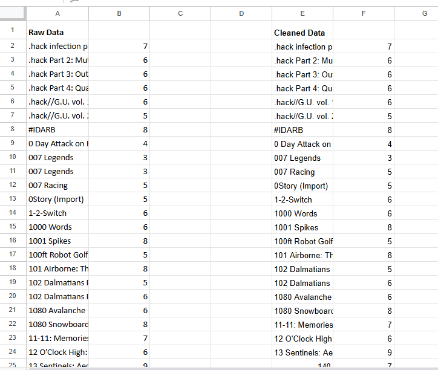
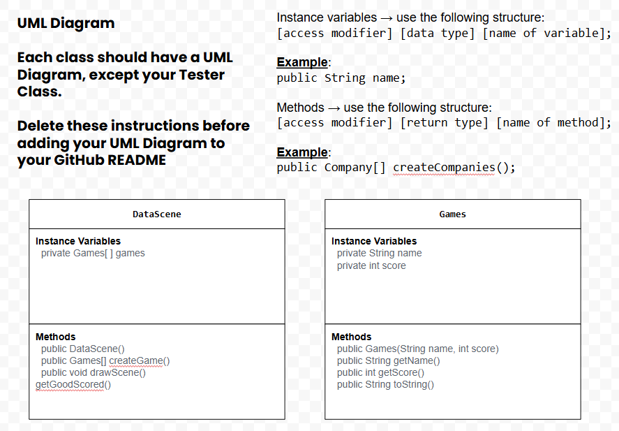

# Abstract-Data-Unit-4
Unit 4 APCSA Project

## Data Set
I used a data set I found on Kaggle about videogames and reviews of them based off a score 1-10, I then cleaned the data of all duplicates and used it in my project.

Link to data set: https://docs.google.com/spreadsheets/d/1JOlzrEFA7DqaQlNB8OA0vQRG9uhjzz-vXIAs1HeV_BU/edit?usp=sharing

## UML Diagram

## Video Link
https://drive.google.com/file/d/1-A4XAY4vErmRd65VtySH13zSAe7gYFdZ/view?usp=drive_link

## Description
My project is about showcasing different videogames, I chose this because it is a topic I am pationate about as both me and my whole family play videogames regularly. My program displays various game titles as well as scores they received from critics, the dataset I used was quite large so in order to show a variety I made a loop to show a set of random games from the list but in order to make the game run quicker for tests I had to cut the max value was shorter than the actual length of the list.